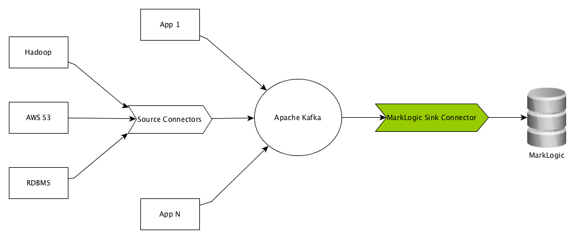

# Credit
This project is a combination of the following:
* Sanju Thomas' original Kafka MarkLogic Sync Connector (https://github.com/sanjuthomas/kafka-connect-marklogic)
* Bill Farber's XML processing additions to the connector (https://github.com/BillFarber/kafka-mbo)
* My own additions and documentation sprinkled in (see commit history)

# Overview
This repository and documentation is meant to be a comprehensive and detailed tutorial to enable novice CentOS, MarkLogic, and/or Apache Kafka users to complete the following:
* Install, create, and configure a new CentOS 7 virtual machine
* Install and configure the  prerequisite software
* Install, configure, and start MarkLogic Server
* Install, configure, and start Apache Zookeeper and Apache Kafka
* Install, configure, build, and start the MarkLogic Kafka Connector (consumer)
* Create a test Kafka topic and produce some test Kafka messages
* Verify the MarkLogic Kafka Connector interface functionality

# Prerequisite Software
* Download and install [__Oracle Virtual Box__ (5.2.20 r125813)](https://www.virtualbox.org/wiki/Downloads)
* Download [CentOS 7 DVD ISO (7.5.1804)](https://www.centos.org/download)
* Download [Java SE Development Kit 64-bit – JDK (8u191) for RHEL/CentOS 7](https://www.oracle.com/technetwork/java/javase/downloads/jdk8-downloads-2133151.html)
* Download (both files) - [MarkLogic (9.0-7) and MarkLogic Converters & Filters for RHEL/CentOS 7](https://developer.marklogic.com/products)
* Download [Apache Kafka (2.0.0) Binary (Scala 2.11)](https://kafka.apache.org/downloads)
* GIT clone this repository – [marklogic-kafka-connector](https://github.com/ghott86/marklogic-kafka-connector.git)

# Create a New Linux Virtual Machine 
* __NOTE:__ Update names, settings, etc. accordingly
* Start up the Virtual Box application
* Click __New__ (top left)
  * Specify an appropriate name: __Kafka_MBO__
  * Type: __Linux__
  * Version: __Linux 2.6 / 3.x / 4.x (64-bit)__
  * Memory size: __4096 MB__
  * Hard disk: __Create a virtual hard disk now__
  * Click __Create__
* HDD Setup
  * File location: Kafka_MBO
  * File size: 40 GB
  * Hard disk file type: VDI (VirtualBox Disk Image)
  * Storage on physical hard disk: Dynamically allocated
  * Click Create
* Highlight the VM you just created in the VM list (Kafka_MBO) and Click Settings (top left)
  * Click the System button at the top and click the Processor button below that
    * Set Processors to: 2
  * Click the Network button at the top
    * Set Adapter 1 as follows:
      * Enable Network Adapter: checked
      * Attached to: NAT
      * Adapter type: Intel PRO/1000 MT Desktop
      * Cable connected: checked
    * Set Adapter 2 as follows:
      * Enable Network Adapter: checked
      * Attached to: Bridged Adapter
      * Name: en0: Wi-Fi AirPort
      * Adapter type: Intel PRO/1000 MT Desktop
      * Promiscuous mode: Allow All
      * Cable connected: checked
  * Click OK to save the settings

# Start VM and Install CentOS 7
* Click the Start button at the top left and select Normal Start
* Click the small folder button to the left of the dialog box and navigate to the directory where the CentOS 7 DVD ISO that was downloaded earlier is stored
* Select the CentOS 7 DVD ISO file and click Start
* On the CentOS 7 boot menu highlight the Install CentOS 7 option and press enter
* Configure CentOS 7 install
  * Language: English, English (United States)
  * Date & Time: Americas/New York time zone (default)
  * Keyboard: English (US) (default)
  * Language Support: English (United States) (default)
  * Installation Source: Local media (default)
  * Software selection: Server with GUI
  * Installation destination: 
    * Local standard disks: 40gb ATA VBox HDD
    * Partitioning: Automatically configure partitioning
  * Kdump: enabled (default)
  * Network and host name
    * Select each of the adapters and complete the following
      * Turn both adapters in the list ON
      * Configure > General > Automatically connect when available - checked
      * Configure > IPv6 Settings > Method: Ignore
    * Security policy: No profile selected (default)
    * Click Begin Installation
    * Set root password
    * Create a user named: developer
    * Set developer password
    * Click Reboot once the installation has completed
    * License information: check the I accept check box and click Finish Configuration
    * Select Not listed? on the “Login” screen and login as root
    * Select English on the “Welcome” screen
    * Select English (US) on the “Typing” screen
    * Turn location services OFF and click Next
    * Click Skip on the Connect Accounts screen
    * Click the Start using CentOS Linux button

# Configure CentOS 7 Firewall
* Open a new terminal on the VM and execute the following command to see the IPv4 addresses
  * ```ifconfig -a```
* You can disable the entire firewall by running (not recommended unless you have an additional firewall protecting your network or server)
  * ```systemctl stop firewalld```
  * ```systemctl disable firewalld```
* Check to see if any sources currently exist
  * ```firewall-cmd --permanent --zone=public --list-sources```
* Add your current subnet range(s) as a source (update IP addresses accordingly)
  * ```firewall-cmd --permanent --zone=public --add-source=10.0.0.0/24```
  * ```firewall-cmd --permanent --zone=public --add-source=192.168.150.0/24```
* Add ports 1 through 9999 for TCP and UDP
  * ```firewall-cmd --permanent --zone=public --add-port=1-9999/tcp```
  * ```firewall-cmd --permanent --zone=public --add-port=1-9999/udp```
* Reload the firewall config and check to make sure everything was added
  * ```firewall-cmd --reload```
  * ```firewall-cmd --zone=public --list-all```

# Transfer Downloaded Software
* Open a new terminal on the host machine and change directory to where the software in step 2 was downloaded
* NOTE: Update IP address and filenames accordingly
  * ```scp jdk-8u191-linux-x64.rpm root@192.168.150.53:```
  * ```scp MarkLogic-9.0-7.x86_64.rpm root@192.168.150.53:```
  * ```scp MarkLogicConverters-9.0-7.x86_64.rpm root@192.168.150.53:```
  * ```scp kafka_2.11-2.0.0.tgz root@192.168.150.53:```
* Zip and transfer the marklogic-kafka-connector project repository
  * Open a new terminal on the host machine and change directory to where the marklogic-kafka-connector repository was cloned
  * ```zip -r marklogic-kafka-connector.zip marklogic-kafka-connector```
  * ```scp marklogic-kafka-connector.zip root@192.168.150.53:```

# Install Prerequisite Libraries
* Open a new terminal on the VM and run the following yum commands
  * ```yum check-update```
  * ```yum update```
  * ```yum install maven```
  * ```yum install redhat-lsb lsb glibc glibc.i686 gdb```
  * ```yum install libgcc libc.so.6 libgcc.i686 libstdc++ libstdc++.i686```

# Install Java
* Open a new terminal on the VM and change directory to where the software in step 6 was transferred
  * ```rpm -Uvh jdk-8u191-linux-x64.rpm```
* Verify installation
  * ```java -version```

# Install MarkLogic Server
* Open a new terminal on the VM and change directory to where the software in step 6 was transferred
* Install MarkLogic and MarkLogic Converters
  * ```rpm -i MarkLogic-9.0-7.x86_64.rpm```
  * ```rpm -i MarkLogicConverters-9.0-7.x86_64.rpm```
* Start MarkLogic
  * ```service MarkLogic start```
* Configure MarkLogic
  * On the host machine, open a new web browser and navigate to: http://192.168.150.53:8001
  * Server install: Click OK
  * Join a cluster: Click Skip
  * Security setup
    * Admin: admin
    * Admin Password: password
    * Realm: public
    * Wallet Password: password
    * Encrypt Security Database: unchecked
    * Click OK
  * Enter the admin username/password you defined in the security setup

# OPTIONAL: Kafka Background and Terminology
* Kafka is: a fast, scalable, and distributed publish-subscribe based fault-tolerant messaging system written in Scala and Java
* Kafka has: excellent throughput, built-in partitioning, replication, and inherent fault-tolerance
* In a publish-subscribe messaging system such as Kafka, messages produced by “publishers” are persisted in a topic and “subscribers” can subscribe to one or more topics and consume all the messages in the topic(s).
* Kafka messages are persisted on the disk and replicated within the cluster to prevent data loss. Kafka is built on top of the ZooKeeper synchronization service.
* Kafka is a unified platform for handling all the real-time data feeds. Kafka supports low latency message delivery and gives guaranteed fault tolerance in the presence of machine failures. It has the ability to handle a large number of diverse consumers. Kafka is very fast, performs 2 million writes/sec. Kafka persists all data to the disk, which essentially means that all the writes go to the page cache of the OS (RAM). This makes it very efficient to transfer data from page cache to a network socket.
* ZooKeeper - Kafka is built on top of the Apache ZooKeeper synchronization service.  ZooKeeper is a critical dependency of Kafka and is utilized as a distributed configuration and synchronization service. It serves as the coordination interface between the Kafka brokers and consumers. The Kafka servers share information via a ZooKeeper cluster. Kafka stores basic metadata in ZooKeeper such as information about topics, brokers, consumer offsets (queue readers) and so on.  ZooKeeper is mainly used to notify producers and consumers about the presence of any new broker (or broker failure) in the Kafka cluster.  Since all the critical information is stored in ZooKeeper and it normally replicates this data across its ensemble, failure of the Kafka broker / ZooKeeper does not affect the state of the Kafka cluster. Kafka will restore the state, once the ZooKeeper restarts. This gives zero downtime for Kafka. The leader election between the Kafka broker is also done by using ZooKeeper in the event of leader failure.
* Topics - a stream of messages belonging to a particular category is called a topic. Data is stored in topics. Topics are split into partitions. For each topic, Kafka keeps a minimum of one partition. Each such partition contains messages in an immutable ordered sequence. A partition is implemented as a set of segment files of equal sizes.
* Partition - topics may have one or many partitions, so it can handle an arbitrary amount of data. A Kafka partition is a linearly ordered sequence of messages, where each message is identified by their index (called an offset). All the data in a Kafka cluster is the disjointed union of partitions. Incoming messages are written at the end of a partition and messages are sequentially read by consumers.
* Partition offset - each partitioned message has a unique sequence id called an offset.
* Replicas - nothing but backups of a partition. Replicas are never read or write data. They are used to prevent data loss.
* Brokers - simple system(s) responsible for maintaining the published data.  They are stateless, so the use ZooKeeper to maintain their cluster state. Each broker may have zero or more partitions per topic. Kafka clusters typically consist of multiple brokers to maintain load balance. It is recommended to set up broker partitioning in a way to distribute load among the partitions and the brokers.
* Kafka cluster - Kafka’s having more than one broker are called a Kafka cluster. A Kafka cluster can be expanded without downtime. These clusters are used to manage the persistence and replication of message data.
* Producers - publisher of messages to one or more Kafka topics. Producers send data to Kafka brokers. Every time a producer publishes a message to a broker, the broker simply appends the message to the last segment file. The message will be appended to a partition. Producers can also send messages to a partition of their choice.  When a new broker is added, all producers automatically send a message to that broker.
* Consumers - read data from brokers. Consumers subscribes to one or more topics and consume published messages by pulling data from the brokers.  Since Kafka brokers are stateless, this means consumers have to maintain how many messages have been consumed by using partition offset. If the consumer acknowledges a particular message offset, it implies that the consumer has consumed all prior messages. The consumer issues an asynchronous pull request to the broker to have a buffer of bytes ready to consume. The consumers can rewind or skip to any point in a partition simply by supplying an offset value. Consumer offset value is notified by ZooKeeper.
* Leader - the node responsible for all reads and writes for the given partition. Every partition has one server acting as a leader.
* Follower - node which follows leader instructions. If the leader fails, one of the followers will automatically become the new leader. A follower acts as a normal consumer and pulls messages to update its own data store.

# Unpack Kafka
* Open a new terminal on the VM and change directory to where the software in step 6 was transferred
* Move the Kafka tar file to /opt and untar it:
  * ```mv kafka_2.11-2.0.0.tgz /opt```
  * ```tar -xzf kafka_2.11-2.0.0.tgz```
* Set the $KAFKA_HOME variable:
  * ```export KAFKA_HOME=/opt/kafka_2.11-2.0.0```

# ZooKeeper configuration and startup
* Kafka includes a script to get a quick and dirty single node instance of ZooKeeper up and running
* If needed, update the ZooKeeper configuration by editing the properties file
  * ```vi $KAFKA_HOME/config/zookeeper.properties```
* Start ZooKeeper by running the following command
  * Note: it is recommended to run this command in its own terminal window to allow monitoring of the ZooKeeper log; otherwise, add “&” to the end of the command below
  * ```$KAFKA_HOME/bin/zookeeper-server-start.sh $KAFKA_HOME/config/zookeeper.properties```

# Kafka Configuration and Startup 
* NOTE: This is for a 3 broker cluster
* Update the Kafka configuration by editing the properties file
♣	# vi $KAFKA_HOME/config/server.properties
♣	Edit/update/verify the file has the following (or update per your environment):
•	Line 21:  broker.id=0
•	Line 31 (Uncomment):  listeners=PLAINTEXT://localhost:9092
•	Line 60:  log.dirs=/tmp/kafka-logs-0
o	Create an additional broker configuration by executing the following:
♣	# cp $KAFKA_HOME/config/server.properties $KAFKA_HOME/config/server-1.properties
♣	# vi $KAFKA_HOME/config/server-1.properties
♣	Edit/update/verify the file has the following (or update per your environment):
•	Line 21:  broker.id=1
•	Line 31 (Uncomment):  listeners=PLAINTEXT://localhost:9093
•	Line 60:  log.dirs=/tmp/kafka-logs-1
o	Create an additional broker configuration by executing the following:
♣	# cp $KAFKA_HOME/config/server.properties $KAFKA_HOME/config/server-2.properties
♣	# vi $KAFKA_HOME/config/server-2.properties
♣	Edit/update/verify the file has the following (or update per your environment):
•	Line 21:  broker.id=2
•	Line 31 (Uncomment):  listeners=PLAINTEXT://localhost:9094
•	Line 60:  log.dirs=/tmp/kafka-logs-2
o	Start the three Kafka brokers by running the following commands:
♣	Note: it is recommended to run each command in its own terminal window to allow monitoring of the Kafka log; otherwise, add “&” to the end of the command below
♣	# $KAFKA_HOME/bin/kafka-server-start.sh $KAFKA_HOME/config/server.properties
♣	# $KAFKA_HOME/bin/kafka-server-start.sh $KAFKA_HOME/config/server-1.properties
♣	# $KAFKA_HOME/bin/kafka-server-start.sh $KAFKA_HOME/config/server-2.properties
14.	Unpack the MarkLogic Kafka Connector archive
o	Open a new terminal on the VM and change directory to where the software in step 6 was transferred
o	Move the MarkLogic Kafka Connector file to /opt and untar it:
♣	# mv marklogic-kafka-connector.zip /opt
♣	# unzip marklogic-kafka-connector.zip
o	Set the $ML_CONNECT_HOME variable:
♣	# export ML_CONNECT_HOME=/opt/marklogic-kafka-connector
15.	MarkLogic Kafka Connector configuration, build, and deployment
o	Update the MarkLogic Kafka Connector configuration by editing the properties files:
♣	# vi $ML_CONNECT_HOME/config/marklogic-json-sink.properties
•	Edit/update/verify the file has the following (or update per your environment):
o	Line 6:   topics=json-test
o	Line 14:  localhost
o	Line 15:  8000
o	Line 16:  admin
o	Line 17:  password
♣	# vi $ML_CONNECT_HOME/config/marklogic-xml-sink.properties
•	Edit/update/verify the file has the following (or update per your environment):
o	Line 6:   topics=xml-test
o	Line 14:  localhost
o	Line 15:  8000
o	Line 16:  admin
o	Line 17:  password
♣	# vi $ML_CONNECT_HOME/config/marklogic-json-connect-standalone.properties
•	Update line 17 so it looks like the following:
o	bootstrap.servers=localhost:9092,localhost:9093,localhost:9094
♣	# vi $ML_CONNECT_HOME/config/marklogic-xml-connect-standalone.properties
•	Update line 17 so it looks like the following:
o	bootstrap.servers=localhost:9092,localhost:9093,localhost:9094
o	Build the marklogic-kafka-connector project with maven
♣	# cd $ML_CONNECT_HOME
♣	# mvn clean compile package shade:shade install
o	Copy the marklogic-kafka-connector configuration files and deploy the JAR
♣	# cp $ML_CONNECT_HOME/config/* $KAFKA_HOME/config/
♣	# cp $ML_CONNECT_HOME/target/marklogic-kafka-connector-2.0.jar $KAFKA_HOME/libs/
o	Start the marklogic-kafka-connector consumers
♣	Note: it is recommended to run each command in its own terminal window to allow monitoring of the log; otherwise, add “&” to the end of the command below
♣	# $KAFKA_HOME/bin/connect-standalone.sh $KAFKA_HOME/config/marklogic-json-connect-standalone.properties $KAFKA_HOME/config/marklogic-json-sink.properties
♣	# $KAFKA_HOME/bin/connect-standalone.sh $KAFKA_HOME/config/marklogic-xml-connect-standalone.properties $KAFKA_HOME/config/marklogic-xml-sink.properties
16.	Create a topic, send some messages, and start a consumer
o	Create a new topic test with 1 partition and 3 replicas:
♣	# $KAFKA_HOME/bin/kafka-topics.sh --create --zookeeper localhost:2181 --replication-factor 3 --partitions 1 --topic test 
♣	Make sure we can see that topic when running the --list command:
•	# $KAFKA_HOME/bin/kafka-topics.sh --list --zookeeper localhost:2181 
o	Publish some messages
♣	Kafka comes with a command line client that will take input from a file or from standard input and send it out as messages to the Kafka cluster. By default, each line will be sent as a separate message
•	# $KAFKA_HOME/bin/kafka-console-producer.sh --broker-list localhost:9092 --topic test
•	test-message 1
•	test-message 2
•	Ctrl-C
17.	


https://github.com/sanjuthomas/marklogic-kafka-connector

move git project over
copy files into kafka config dir
maven build
copy jar over




This project is about the component marked in green. Refer [here](http://confluent.io/product/connectors) to see the available list of source connectors.